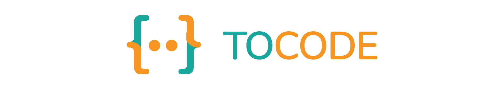

# tocode
<p align="center">
  
</p>

[](https://www.python.org/)
[](LICENSE)
<a href="https://github.com/Amir-Shamsi/tocode" title="Repo Size">

</a>
[](https://pepy.tech/project/tocode)
[](https://pypi.python.org/pypi/SpAlgo/)

  
This is a library which can convert the strings to code and return the literal eval of that it will convert strings which contain:
 - lists
 - tuples
 - dictionaries
 - sets

## Overview

into the python eval and the most important thing in this library that make it unique is:<br>
**when your strings doesn't have any `quotation` no worries it will add qoutations for you!**

example

**before**:
```diff
! "{'this': 5, (Alex, Daniel): are good boys, (5, 4): 8.5}" 
```

**after**:
```diff
+ "{'this': 5, ('Alex', 'Daniel'): 'are good boys', (5, 4): 8.5}
```

## Usage

In the following paragraphs, I am going to describe how you can get and use tocode for your own projects.

###  Getting it

To download tocode library, either fork this github repo or simply use Pypi via pip.
```sh
$ pip install tocode
```

### Using it

tocode was programmed with ease-of-use in mind. First, import literal_eval from tocode.

for more exact usage documents you can see the example files [here](https://github.com/Amir-Shamsi/tocode/blob/master/src/examples)

```Python
import tocode

# Example:
my_array = " ['Hello', Goodbye my friend, 2.5, (4, ok), {one: 450, 'two': 12}] "
my_array = tocode.literal_eval(my_array, no_string_quotation=True)
"""
  if some of the strings don't have quotation set `no_string_quotation` to True
  otherwise set it to False or leave it.
"""
# will return the list into a python list
```
output:
```python
['Hello', 'Goodbye my friend', 2.5, (4, 'ok'), {'one': 450, 'two': 12}]
```

## Support 
Supported versions of python for this library are as follow:
* [Python v3.4](https://www.python.org/downloads/release/python-340/)
* [Python v3.5](https://www.python.org/downloads/release/python-350/)
* [Python v3.6](https://www.python.org/downloads/release/python-360/)
* [Python v3.7](https://www.python.org/downloads/release/python-370/)
* [Python v3.8](https://www.python.org/downloads/release/python-380/)
* [Python v3.9](https://www.python.org/downloads/release/python-390/)
* [Python v3.10](https://www.python.org/downloads/release/python-3100/)


## License
This project is under BST license read it
[here](https://github.com/Amir-Shamsi/tocode/blob/master/LICENSE):
```LICENSE
All rights reserved.

Redistribution and use in source and binary forms, with or without
modification, are permitted provided that the following conditions are met:

1. Redistributions of source code must retain the above copyright notice, this
   list of conditions and the following disclaimer.

2. Redistributions in binary form must reproduce the above copyright notice,
   this list of conditions and the following disclaimer in the documentation
   and/or other materials provided with the distribution.

3. Neither the name of the copyright holder nor the names of its
   contributors may be used to endorse or promote products derived from
   this software without specific prior written permission.

THIS SOFTWARE IS PROVIDED BY THE COPYRIGHT HOLDERS AND CONTRIBUTORS "AS IS"
AND ANY EXPRESS OR IMPLIED WARRANTIES, INCLUDING, BUT NOT LIMITED TO, THE
IMPLIED WARRANTIES OF MERCHANTABILITY AND FITNESS FOR A PARTICULAR PURPOSE ARE
DISCLAIMED. IN NO EVENT SHALL THE COPYRIGHT HOLDER OR CONTRIBUTORS BE LIABLE
FOR ANY DIRECT, INDIRECT, INCIDENTAL, SPECIAL, EXEMPLARY, OR CONSEQUENTIAL
DAMAGES (INCLUDING, BUT NOT LIMITED TO, PROCUREMENT OF SUBSTITUTE GOODS OR
SERVICES; LOSS OF USE, DATA, OR PROFITS; OR BUSINESS INTERRUPTION) HOWEVER
CAUSED AND ON ANY THEORY OF LIABILITY, WHETHER IN CONTRACT, STRICT LIABILITY,
OR TORT (INCLUDING NEGLIGENCE OR OTHERWISE) ARISING IN ANY WAY OUT OF THE USE
OF THIS SOFTWARE, EVEN IF ADVISED OF THE POSSIBILITY OF SUCH DAMAGE.
```
